# Smart Quiz App

A modern Flutter quiz application with a beautiful Material 3 design, featuring both user and admin interfaces.

## Screenshots

<div align="center">
  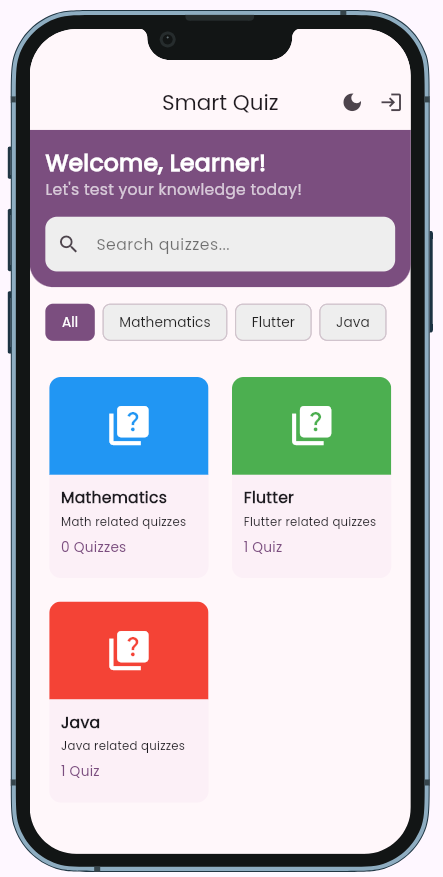
</div>

<div align="center">
  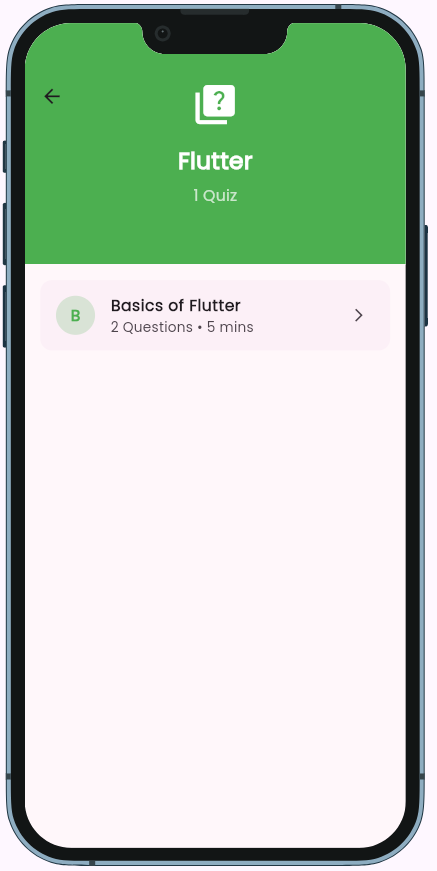
  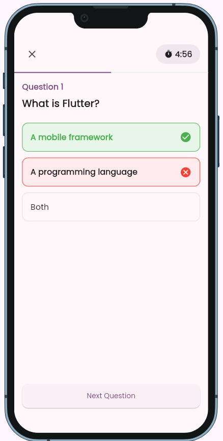
  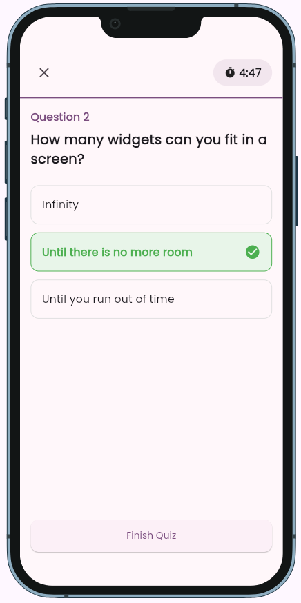
</div>

<div align="center">
  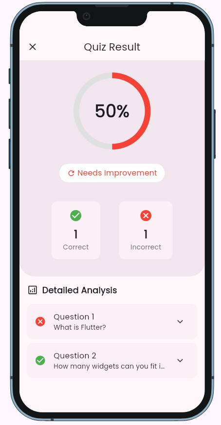
  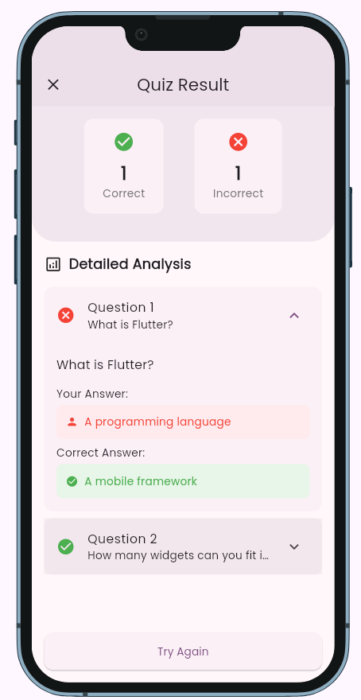
  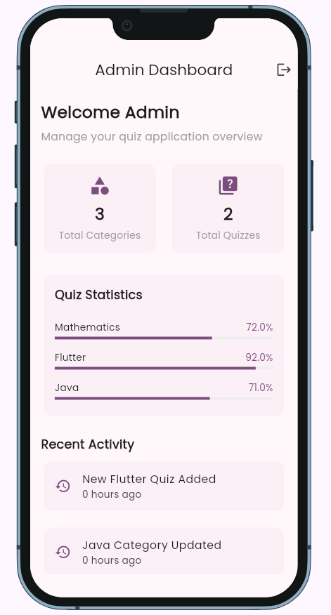
</div>

<div align="center">
  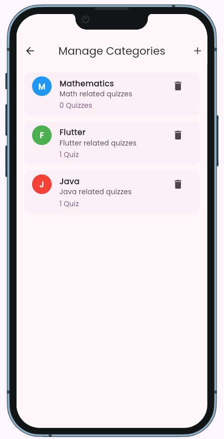
  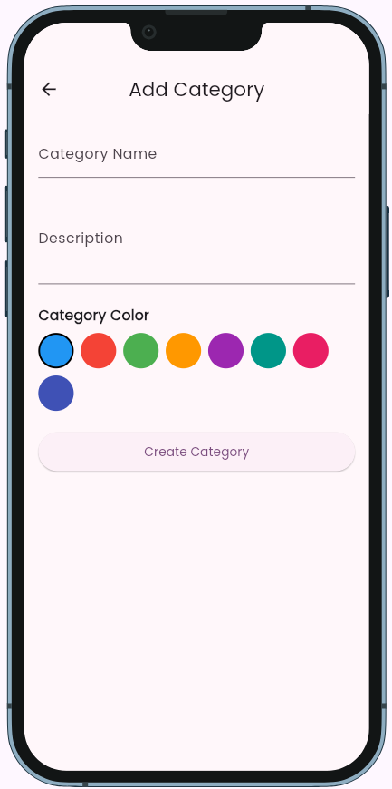
  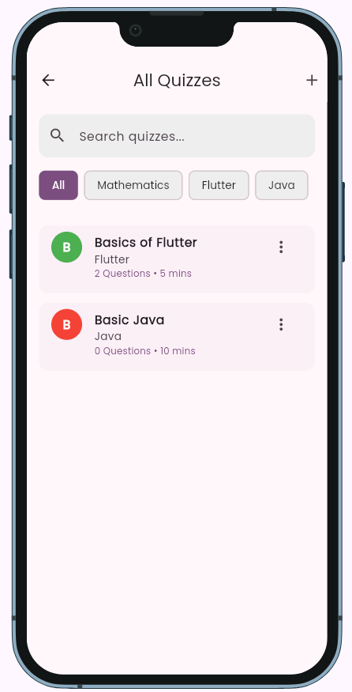
</div>

<div align="center">
  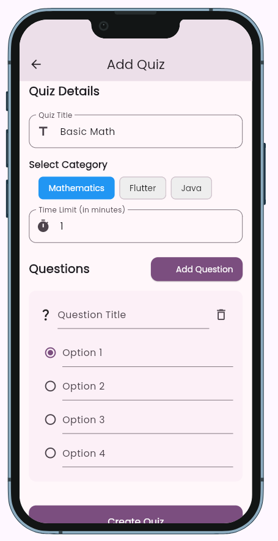
</div>

<details>
<summary>✨ Features</summary>

### For Users
- Browse quizzes by categories
- Take quizzes with timed sessions
- Get instant feedback on answers
- View detailed quiz results with analysis
- Track progress and performance
- Dark/Light theme support

### For Admins
- Manage quiz categories
- Create and edit quizzes
- Add questions with multiple options
- Track quiz statistics
- Monitor user activity
</details>

<details>
<summary>🚀 Getting Started</summary>

### Prerequisites
- Flutter SDK
- Dart SDK
- Android Studio / VS Code

### Installation
1. Clone the repository
```bash
git clone https://github.com/shakeelkhalid1913/smart_quiz.git
```

2. Install dependencies
```bash
flutter pub get
```

3. Run the app
```bash
flutter run
```

### Admin Access
To access the admin panel:
- Email: admin@gmail.com
- Password: admin123
</details>

<details>
<summary>🛠️ Technical Details</summary>

### Architecture
- Material 3 design system
- Provider for state management
- Go Router for navigation
- Singleton pattern for data models

### Key Components
- Dynamic quiz creation
- Category-based organization
- Real-time scoring
- Progress tracking
- Detailed analytics

### Theme
- Purple-based Material 3 color scheme
- Adaptive dark/light modes
- Custom typography with Poppins font
- Consistent elevation and shapes
</details>

## Contributing
Contributions are welcome! Please feel free to submit a Pull Request.

## License
This project is licensed under the MIT License - see the LICENSE file for details
